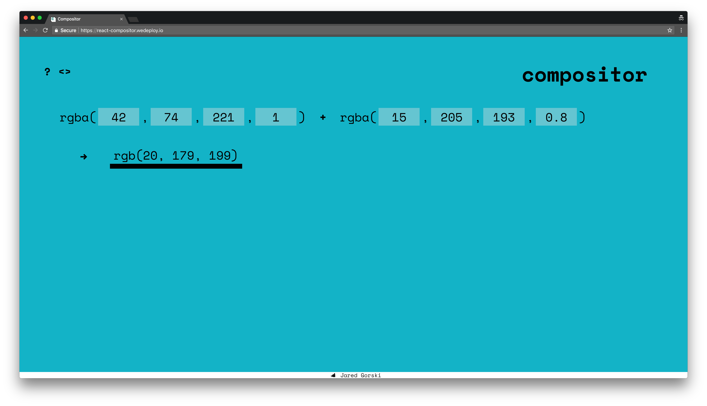

# Compositor
Simple web-app for compositing RGBA colors.

Link: https://react-compositor.wedeploy.io/

### Develop:

`npm i`

then

`npm run build`

and

`npm start`

### Deploy on WeDeploy:
Prerequisite: [WeDeploy CLI](https://wedeploy.com/docs/intro/using-the-command-line/)

`npm run build`

then

`cd build`

and

`we deploy -p compositor`
